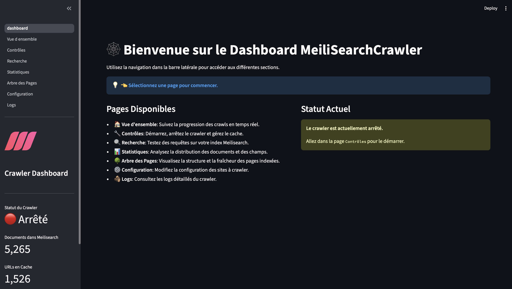

# Meilisearch Crawler

Ce projet est un crawler web asynchrone et performant, conçu pour peupler une instance Meilisearch avec le contenu de divers sites web. Il sert de compagnon au projet [KidSearch](https://github.com/laurentftech/kidsearch), un moteur de recherche sécurisé pour les enfants.

Le crawler est configurable via un simple fichier YAML (`sites.yml`) et prend en charge à la fois les pages HTML et les API JSON comme sources de données.

## Fonctionnalités

- **Asynchrone & Parallèle**: Conçu avec `asyncio` et `aiohttp` pour un crawl simultané à haute vitesse.
- **Tableau de bord interactif**: Une interface web basée sur Streamlit pour surveiller, contrôler et configurer le crawler en temps réel.
- **Crawl multi-sites**: Explore plusieurs sites web définis dans un unique fichier `sites.yml`.
- **Sources flexibles**: Prend en charge les sites web HTML standards et les API JSON.
- **Indexation incrémentielle**: Utilise un cache local pour ne réindexer que les pages qui ont changé depuis le dernier crawl.
- **Reprise du crawl**: Reprend automatiquement un crawl qui a été arrêté par une limite de pages.
- **Extraction de contenu intelligente**: Utilise `trafilatura` pour une détection robuste du contenu principal.
- **Détection de la langue**: Détecte automatiquement la langue des pages.
- **Respect de `robots.txt`**: Suit les protocoles d'exclusion standards.
- **Exclusions globales et par site**: Définissez des motifs d'URL globaux et spécifiques au site à ignorer.
- **CLI avancée**: Options de ligne de commande puissantes pour un contrôle précis.



## Prérequis

- Python 3.8+
- Une instance Meilisearch en cours d'exécution (v1.0 ou supérieure).

## 1. Configuration de Meilisearch

Ce crawler a besoin d'une instance Meilisearch pour y envoyer ses données. La manière la plus simple d'en obtenir une est avec Docker.

1.  **Installez Meilisearch**: Suivez le guide de démarrage rapide officiel de Meilisearch.
2.  **Lancez Meilisearch avec une clé principale**:
    ```bash
    docker run -it --rm \
      -p 7700:7700 \
      -e MEILI_MASTER_KEY='une_cle_maitre_longue_et_securisee' \
      -v $(pwd)/meili_data:/meili_data \
      ghcr.io/meilisearch/meilisearch:latest
    ```
3.  **Obtenez votre URL et votre clé API**:
    -   **URL**: `http://localhost:7700`
    -   **Clé API**: La `MEILI_MASTER_KEY` que vous avez définie.

## 2. Configuration du Crawler

1.  **Clonez le dépôt**:
    ```bash
    git clone https://github.com/laurentftech/MeilisearchCrawler.git
    cd MeilisearchCrawler
    ```

2.  **Créez et activez un environnement virtuel**:
    ```bash
    python3 -m venv venv
    source venv/bin/activate
    ```

3.  **Installez les dépendances**:
    ```bash
    pip install -r requirements.txt
    ```

4.  **Configurez les variables d'environnement**:
    Copiez le fichier d'exemple et modifiez-le avec vos informations d'identification Meilisearch.
    ```bash
    cp .env.example .env
    ```
    Maintenant, ouvrez `.env` et remplissez vos `MEILI_URL` et `MEILI_KEY`.

5.  **Configurez les sites à crawler**:
    Copiez le fichier d'exemple des sites.
    ```bash
    cp config/sites.yml.example config/sites.yml
    ```
    Vous pouvez maintenant modifier `config/sites.yml` pour ajouter les sites que vous souhaitez indexer.

## 3. Lancer le Crawler

Vous pouvez lancer le crawler via la ligne de commande ou le tableau de bord interactif.

### Interface en Ligne de Commande

Exécutez simplement le script `crawler.py`:

```sh
python crawler.py # Lance un crawl incrémentiel sur tous les sites
```

**Options courantes:**

-   `--force`: Force une réindexation complète de toutes les pages, en ignorant le cache.
-   `--site "Nom du Site"`: N'explore que le site spécifié.
-   `--workers N`: Définit le nombre de requêtes parallèles (ex: `--workers 10`).
-   `--stats-only`: Affiche les statistiques du cache sans lancer de crawl.

**Exemple:**
```sh
# Force une réindexation de "BBC Bitesize" avec 10 workers parallèles
python crawler.py --force --site "BBC Bitesize" --workers 10
```

### Tableau de Bord Interactif

Le projet inclut un tableau de bord web pour surveiller et contrôler le crawler en temps réel.

**Comment le lancer:**

1.  Depuis la racine du projet, exécutez la commande suivante:
    ```bash
    streamlit run dashboard/dashboard.py
    ```
2.  Ouvrez votre navigateur web à l'URL locale fournie par Streamlit (généralement `http://localhost:8501`).

**Fonctionnalités:**

-   **🏠 Vue d'ensemble**: Un résumé en temps réel du crawl en cours (pages indexées, sites explorés, erreurs, graphiques de progression).
-   **🔧 Contrôles**: Démarrez ou arrêtez le crawler, sélectionnez un site spécifique, forcez une réindexation et videz le cache.
-   **🔍 Recherche**: Une interface de recherche pour tester des requêtes directement sur votre index Meilisearch.
-   **📊 Statistiques**: Des statistiques détaillées sur votre index Meilisearch, y compris la distribution des documents par site.
-   **🌳 Arbre des Pages**: Visualisez la structure, la fraîcheur des pages indexées et les pages en attente de crawl.
-   **⚙️ Configuration**: Un éditeur interactif pour voir et modifier le fichier de configuration `sites.yml`.
-   **🪵 Logs**: Une vue en direct du fichier de log du crawler.

## 4. Configuration de `sites.yml`

Le fichier `config/sites.yml` vous permet de définir une liste de sites à crawler. Chaque site est un objet avec les propriétés suivantes:

- `name`: (String) Le nom du site, utilisé pour le filtrage dans Meilisearch.
- `crawl`: (String) L'URL de départ pour le crawl.
- `type`: (String) Le type de contenu. Peut être `html` ou `json`.
- `delay`: (Float, optionnel) Délai minimum en secondes entre les requêtes pour ce site.
- `max_pages`: (Integer) Le nombre maximum de pages à crawler. Mettre `0` ou omettre pour ne pas avoir de limite.
- `depth`: (Integer) La profondeur maximale pour suivre les liens à partir de l'URL de départ.
- `selector`: (String, optionnel) Pour les sites HTML, un sélecteur CSS spécifique (ex: `.main-article`) pour cibler la zone de contenu principal.
- `lang`: (String, optionnel) Pour les sources JSON, spécifie la langue du contenu (ex: "en", "fr").
- `exclude`: (Liste de chaînes) Une liste de motifs d'URL à ignorer complètement.
- `no_index`: (Liste de chaînes) Une liste de motifs d'URL à visiter pour découvrir des liens mais à ne pas indexer.

### Configuration spécifique au type JSON

Si `type` est `json`, vous devez également fournir un objet `json` avec le mappage suivant:

- `root`: La clé dans la réponse JSON qui contient la liste des éléments.
- `title`: La clé du titre de l'élément.
- `url`: La clé de l'URL de l'élément. Vous pouvez utiliser `{{nom_de_la_cle}}` pour substituer une valeur.
- `content`: Une liste de clés séparées par des virgules pour le contenu.
- `image`: La clé de l'URL de l'image principale de l'élément.

## 5. Lancer les Tests

Pour exécuter la suite de tests, installez d'abord les dépendances de développement:

```bash
pip install pytest
```

Ensuite, lancez les tests:
```bash
pytest
```
