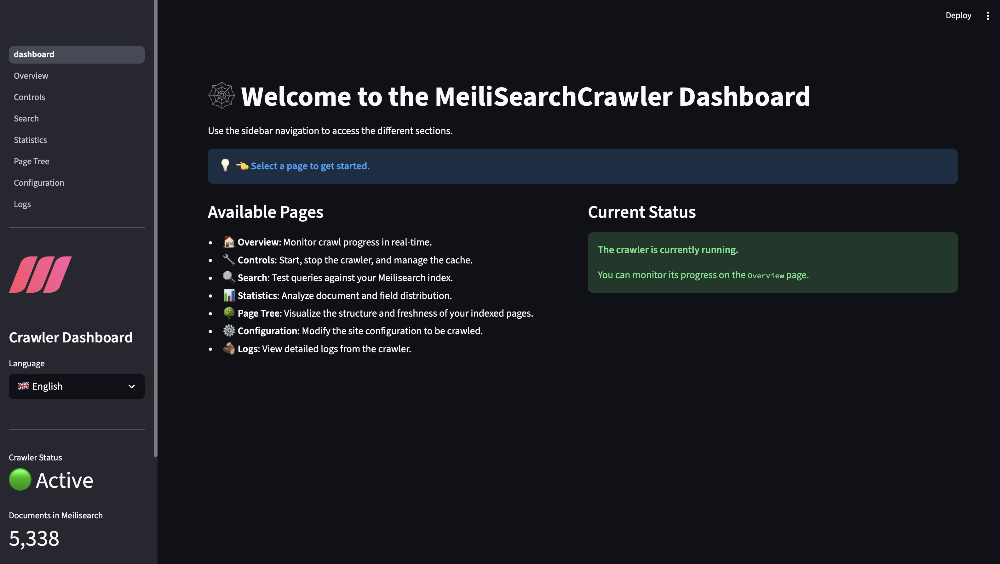

# KidSearch API & Meilisearch Crawler

This project provides a complete backend solution for a safe search engine like [KidSearch](https://github.com/laurentftech/kidsearch). It consists of two main components:

1.  A **KidSearch API Server**: A FastAPI-based server that performs federated searches across multiple sources (local Meilisearch, Google, Wikipedia) and uses a local model to semantically rerank results.
2.  A **Meilisearch Crawler**: A high-performance, asynchronous web crawler that populates the local Meilisearch instance with content from websites, JSON APIs, and MediaWiki sites.

This combination creates a powerful and flexible search backend, capable of delivering relevant and safe results.

## ✨ Features

### KidSearch API Server
- **FastAPI Backend**: A lightweight, high-performance API server to expose search functionalities.
- **Federated Search**: Aggregates results from multiple sources in real-time: the local Meilisearch index, Google Custom Search (GSE), and Wikipedia/Vikidia APIs.
- **Optimized Hybrid Reranking**: Fetches results from all sources, computes missing embeddings on-the-fly, and then uses a local cross-encoder model to intelligently rerank the combined list based on semantic relevance. This ensures the best content is always prioritized with minimal latency.
- **Ready for Production**: Can be easily deployed as a Docker container.

### Core Crawler
- **Asynchronous & Parallel**: Built with `asyncio` and `aiohttp` for high-speed, concurrent crawling.
- **Flexible Sources**: Natively supports crawling standard HTML websites, JSON APIs, and MediaWiki-powered sites (like Wikipedia or Vikidia).
- **Incremental Crawling**: Uses a local cache to only re-index pages that have changed since the last crawl, saving time and resources.
- **Crawl Resumption**: If a crawl is interrupted, it can be seamlessly resumed later.
- **Smart Content Extraction**: Uses `trafilatura` for robust main content detection from HTML.
- **Respects `robots.txt`**: Follows standard exclusion protocols.
- **Depth-First Crawling**: Prioritizes exploring newly discovered links to dig deeper into a site's structure first.

### Search & Indexing
- **Semantic Search Ready**: Can generate and index vector embeddings using Google Gemini or a local HuggingFace model.
- **Graceful Quota Management**: Automatically detects when the Gemini API quota is exceeded and safely stops the crawl.

### Monitoring & Control
- **Interactive Dashboard**: A Streamlit-based web UI to monitor, control, and configure the crawler in real-time.
- **Advanced CLI**: Powerful command-line options for fine-grained control.



## Prerequisites

- Python 3.8+
- A running Meilisearch instance (v1.0 or higher).
- A Google Gemini API Key (if using the embeddings feature).

## 1. Setting up Meilisearch

This crawler needs a Meilisearch instance to send its data to. The easiest way to get one running is with Docker.

1.  **Install Meilisearch**: Follow the official [Meilisearch Quick Start guide](https://www.meilisearch.com/docs/learn/getting_started/quick_start).
2.  **Run Meilisearch with a Master Key**:
    ```bash
    docker run -it --rm \
      -p 7700:7700 \
      -e MEILI_MASTER_KEY='a_master_key_that_is_long_and_secure' \
      -v $(pwd)/meili_data:/meili_data \
      ghcr.io/meilisearch/meilisearch:latest
    ```
3.  **Get your URL and API Key**:
    -   **URL**: `http://localhost:7700`
    -   **API Key**: The `MEILI_MASTER_KEY` you defined.

## 2. Setting up the Crawler

1.  **Clone the repository**:
    ```bash
    git clone https://github.com/laurentftech/MeilisearchCrawler.git
    cd MeilisearchCrawler
    ```

2.  **Create and activate a virtual environment**:
    ```bash
    python3 -m venv venv
    source venv/bin/activate
    ```

3.  **Install dependencies**:
    ```bash
    pip install -r requirements.txt
    ```

4.  **Configure environment variables**:
    Copy the example file and edit it with your credentials.
    ```bash
    cp .env.example .env
    ```
    Now, open `.env` and fill in:
    - `MEILI_URL`: Your Meilisearch instance URL.
    - `MEILI_KEY`: Your Meilisearch master key.
    - `GEMINI_API_KEY`: Your Google Gemini API key (optional, but required for the `--embeddings` feature).

5.  **Configure sites to crawl**:
    Copy the example sites file.
    ```bash
    cp config/sites.yml.example config/sites.yml
    ```
    You can now edit `config/sites.yml` to add the sites you want to index.

## 3. Running the Application

The project can be run in different modes: crawler, API server, or dashboard.

> 📖 **Complete API documentation available here:** [API_README.md](API_README.md)

### Crawler (Command-Line)

Run the `crawler.py` script to start indexing content.

```sh
python crawler.py # Runs an incremental crawl on all sites
```

**Common Options:**

-   `--force`: Forces a full re-crawl of all pages, ignoring the cache.
-   `--site "Site Name"`: Crawls only the specified site.
-   `--embeddings`: Activates the generation of Gemini embeddings for semantic search.
-   `--workers N`: Sets the number of parallel requests (e.g., `--workers 10`).
-   `--stats-only`: Displays cache statistics without running a crawl.

**Example:**
```sh
# Force a re-crawl of "Vikidia" with embeddings enabled
python crawler.py --force --site "Vikidia" --embeddings
```

### KidSearch API Server

Run the `api.py` script to start the FastAPI server, which exposes the search endpoint.

```sh
python api.py
```

The API will be available at `http://localhost:8000`. You can access the interactive documentation at `http://localhost:8000/docs`.

### Interactive Dashboard

The project includes a web-based dashboard to monitor and control the crawler in real-time.

**How to Run:**

1.  From the project root, run the following command:
    ```bash
    streamlit run dashboard/dashboard.py
    ```
2.  Open your web browser to the local URL provided by Streamlit (usually `http://localhost:8501`).

**Features:**

-   **🏠 Overview**: A real-time summary of the current crawl.
-   **🔧 Controls**: Start or stop the crawler, select sites, force re-crawls, and manage embeddings.
-   **🔍 Search**: A live search interface to test queries directly against your Meilisearch index.
-   **📊 Statistics**: Detailed statistics about your Meilisearch index.
-   **🌳 Page Tree**: An interactive visualization of your site's structure.
-   **⚙️ Configuration**: An interactive editor for the `sites.yml` file.
-   **🪵 Logs**: A live view of the crawler's log file.
-   **📈 API Metrics**: A dashboard to monitor API performance and metrics.

## 4. Configuration of `sites.yml`

The `config/sites.yml` file allows you to define a list of sites to crawl. Each site is an object with the following properties:

- `name`: (String) The name of the site, used for filtering in Meilisearch.
- `crawl`: (String) The starting URL for the crawl.
- `type`: (String) The type of content. Can be `html`, `json`, or `mediawiki`.
- `max_pages`: (Integer) The maximum number of pages to crawl. Set to `0` or omit for no limit.
- `depth`: (Integer) For `html` sites, the maximum depth to follow links from the starting URL.
- `delay`: (Float, optional) A specific delay in seconds between requests for this site, overriding the default. Useful for sensitive servers.
- `selector`: (String, optional) For `html` sites, a specific CSS selector (e.g., `.main-article`) to pinpoint the main content area.
- `lang`: (String, optional) For `json` sources, specifies the language of the content (e.g., "en", "fr").
- `exclude`: (List of strings) A list of URL patterns to completely ignore.
- `no_index`: (List of strings) A list of URL patterns to visit for link discovery but not to index.

### `html` Type
This is the standard type for crawling regular websites. It will start at the `crawl` URL and follow links up to the specified `depth`.

### `json` Type
For this type, you must also provide a `json` object with the following mapping:
- `root`: The key in the JSON response that contains the list of items.
- `title`: The key for the item's title.
- `url`: A template for the item's URL. You can use `{{key_name}}` to substitute a value from the item.
- `content`: A comma-separated list of keys for the content.
- `image`: The key for the item's main image URL.

### `mediawiki` Type
This type is optimized for sites running on MediaWiki software (like Wikipedia, Vikidia). It uses the MediaWiki API to efficiently fetch all pages, avoiding the need for traditional link-by-link crawling.
- The `crawl` URL should be the base URL of the wiki (e.g., `https://fr.vikidia.org`).
- `depth` and `selector` are not used for this type.

## 5. Dashboard Authentication

### 🧩 KidSearch Authentication

KidSearch natively supports any **OpenID Connect (OIDC)** compatible identity provider, such as:

- 🔐 **Pocket ID** (recommended for self-hosted usage)
- 🛡️ **Authentik** (for multi-user environments)
- 🔵 **Google OAuth** (sign in with Google accounts)
- ⚫ **GitHub OAuth** (sign in with GitHub accounts)
- 🔑 **Simple Password** (basic authentication)

### OIDC Configuration (Recommended)

For any standard OIDC provider (Pocket ID, Authentik, Keycloak, etc.), simply provide the following variables in your `.env`:

```bash
OIDC_ISSUER=https://auth.example.com
OIDC_CLIENT_ID=your_client_id
OIDC_CLIENT_SECRET=your_client_secret
OIDC_REDIRECT_URI=http://localhost:8501/
```

OIDC endpoints (authorization, token, userinfo) are automatically discovered via `/.well-known/openid-configuration`.

### Setting up OAuth Authentication

To enable OAuth authentication, configure the following in your `.env` file:

**For Google OAuth:**
```bash
GOOGLE_OAUTH_CLIENT_ID=your_client_id.apps.googleusercontent.com
GOOGLE_OAUTH_CLIENT_SECRET=your_client_secret
GOOGLE_OAUTH_REDIRECT_URI=http://localhost:8501/
ALLOWED_EMAILS=user1@gmail.com,user2@example.com
```

Get credentials from: https://console.cloud.google.com/apis/credentials

**For GitHub OAuth:**
```bash
GITHUB_OAUTH_CLIENT_ID=your_github_client_id
GITHUB_OAUTH_CLIENT_SECRET=your_github_client_secret
GITHUB_OAUTH_REDIRECT_URI=http://localhost:8501/
ALLOWED_EMAILS=user1@example.com,user2@company.com
```

Get credentials from: https://github.com/settings/developers

### Email Whitelist

The `ALLOWED_EMAILS` variable restricts access to specific email addresses:
- If empty: all authenticated users can access (not recommended for production)
- If set: only listed emails can access the dashboard

### Diagnosing Authentication Issues

If you're having trouble with OAuth login, use the diagnostic tools:

**1. Check your configuration:**
```bash
python3 check_auth_config.py
```

This will show:
- Which authentication providers are configured
- Whether your credentials are set
- If an email is allowed to access

**2. Test a specific email:**
```bash
python3 check_auth_config.py user@example.com
```

**3. Monitor authentication logs:**
```bash
./watch_auth_logs.sh
```

Or view the logs directly:
```bash
tail -f data/logs/auth.log
```

The logs will show:
- ✅ Successful logins with email addresses
- ❌ Failed logins with detailed reasons (email not authorized, email missing, etc.)
- 🔍 Full OAuth response details (in DEBUG mode)

## 6. Running Tests

To run the test suite, first install the development dependencies:

```bash
pip install pytest
```

Then, run the tests:
```bash
pytest
```
